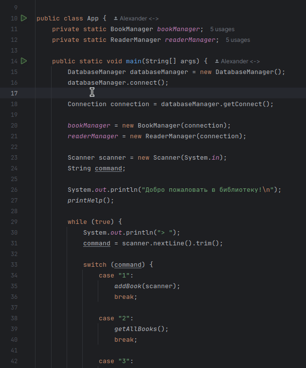

## Проверка работы приложения

Для проверки работы приложения выполните следующие шаги:

### 1. Создание базы данных

1. Создайте базу данных с именем library_db в вашей системе управления базами данных (например, PostgreSQL).

### 2. Создание таблиц

2. Создайте две таблицы: books и readers. Скрипты для создания таблиц доступны в папке sql. Запустите соответствующие SQL-скрипты для создания таблиц в вашей базе данных.

### 3. Настройка подключения к базе данных

3. Откройте файл manager/DatabaseManager.java и укажите ваши учетные данные для доступа к базе данных:
```
private static final String URL = "jdbc:postgresql://localhost/library_db";
private static final String USER = "..."; // Имя пользователя
private static final String PASSWORD = "..."; // Пароль
```
### 4. Запуск программы

4. Для запуска приложения выполните метод main в файле App.java.


